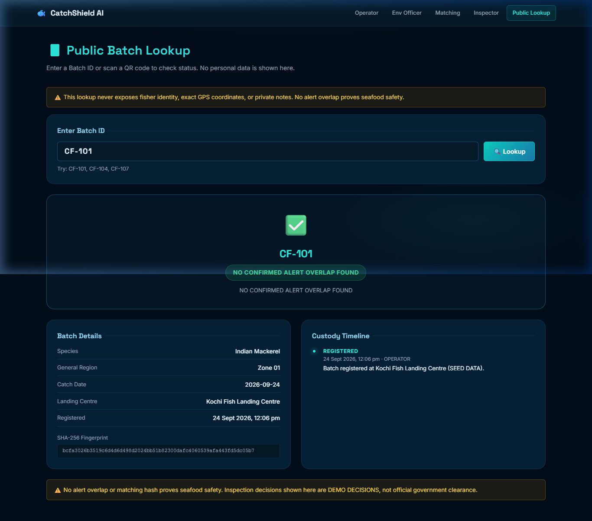
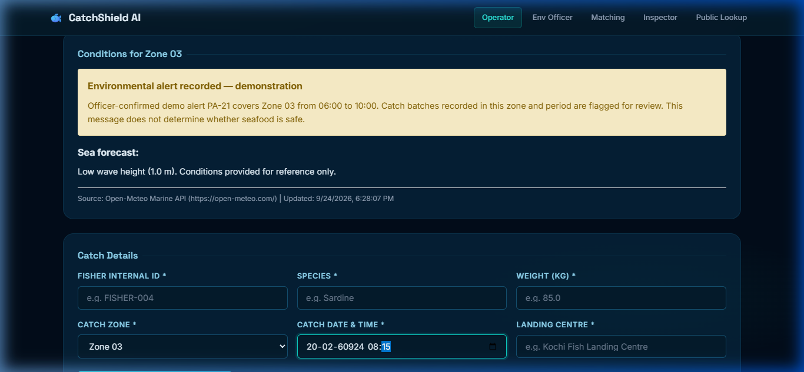
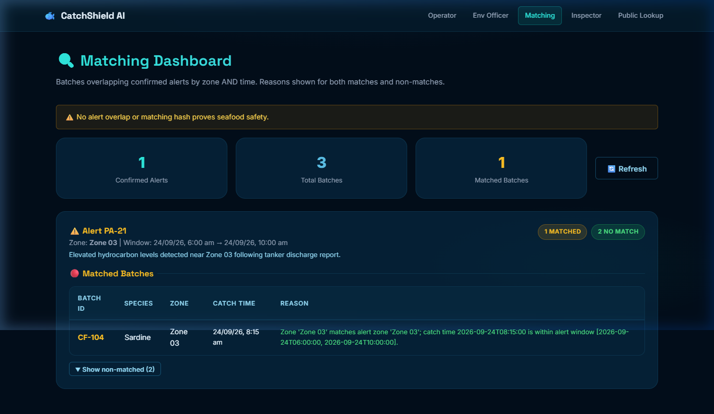

# 🐟 CatchShield AI
[](https://render.com/deploy?repo=https://github.com/Mohanapriya-sparks/CatchShield-AI)
### Traceability proves where the fish came from. **CatchShield proves what happened to the water it swam in.**

Real-time environmental safeguarding for **seafood supply chains**. Register a catch batch at the landing center, and CatchShield cross-references it against live, officer-confirmed marine alerts (spills, red tides, contamination) in that exact zone and timeframe. It automatically flags overlapping batches for inspection, proving an unbroken, verifiable chain of safety to the final consumer.

> **This is a live engine.** Register a new batch in Zone 03 on the [Operator Dashboard](#-quick-start-local-development). Then confirm a new alert for Zone 03 as an Environmental Officer. The matching engine will instantly flag your batch based on the timestamp overlap. We show you how to verify this live below.

<p align="center">
  
  
  
  
  
  
  
</p>

<p align="center">
  <b>🏆 Tracks:</b>
  
</p>

<p align="center">
  <b><a href="#-quick-start-local-development">🔴 Run Locally</a></b> ·
  <b><a href="docs/demo.webp">🎬 Demo Video</a></b> ·
  <a href="docs/ARCHITECTURE.md">Architecture</a> ·
  <a href="docs/DEMO_GUIDE.md">Demo Guide</a>
</p>

---

## 🎥 Demo & Deliverables

- **Demo Video Link** (Mandatory): [Watch the demo](docs/demo.webp)
- **Deployment Link**: [https://catchshield-frontend.onrender.com](https://catchshield-frontend.onrender.com)
- **Pitch Deck / PPT**: [View the deck](docs/PITCH_DECK.md)
- **Technical Documentation**: [docs/ARCHITECTURE.md](docs/ARCHITECTURE.md) · [Security & Limitations](docs/SECURITY_AND_LIMITATIONS.md)
- **Live API**: [catchshield-backend.onrender.com/docs](https://catchshield-backend.onrender.com/docs) — interactive OpenAPI docs

---

## 📌 Problem & Domain

Current supply chain traceability systems are built to answer one question: *Where did this seafood originate?* But if an environmental disaster—such as an oil spill, toxic algal bloom, or industrial runoff—occurs in that specific marine zone, standard systems do not automatically intercept the affected catch. **Catch records and environmental alerts exist in complete silos.**

By the time authorities manually issue a recall based on a confirmed spill, the affected batch is already in transit or on a consumer's plate.

**Our thesis: Seafood safety requires intersecting time and space.** Traceability is useless if it doesn't account for what happened in the water *while* the fish was there. That's why CatchShield acts as an automated matching engine connecting fisher-reported catch coordinates directly to active environmental officer alerts.

**Themes Selected:**
- [x] **Supply Chain Transparency** — **`PRIMARY`**
  Creating a verifiable timeline that connects environmental health to specific catch batches, ensuring that flagged seafood undergoes rigorous inspection before reaching consumers.
- [x] **Environmental Monitoring** — **`SECONDARY`**
  Providing officers with a dashboard to review marine conditions and issue time-bound zone alerts.

---

## 🎯 Objective

**The target users**
Fisheries management authorities, landing center operators, safety inspectors, and conscious consumers.

**The pain point**
Existing traceability tools track logistics (vessel to truck to market). They do not track the environmental reality of the ocean at the moment of catch. Bridging this gap manually requires cross-referencing logbooks against coast guard reports—which is too slow for fresh seafood.

**The value we provide**
CatchShield AI turns a single batch registration into an automated, privacy-first safety verification:

| You give it | It gives you back |
|---|---|
| A new catch registration | A cryptographic Batch ID, QR code passport, and initial timeline status |
| An officer's zone alert | Instant systemic flagging of any batches registered in that zone during the alert window |
| A flagged batch | A dedicated review queue for safety inspectors to make a clearance decision |
| A Batch QR Scan (Consumer) | A redacted, privacy-safe timeline proving the seafood was cleared of environmental hazards |

---

## 🔬 Don't Take Our Word For It — Falsify It

Our prototype is fully interactive. You don't have to rely on pre-seeded data. Here is how to prove the matching engine works dynamically on your own machine:

| # | Do this | Why it proves the engine |
|---|---|---|
| **1** | Open the **Operator** tab and register a batch in **Zone 01** today. | The system generates a completely new cryptographic batch passport. |
| **2** | Run **Matching Dashboard**. | Your batch will show as "Cleared" because Zone 01 has no alerts today. |
| **3** | Open **Env Officer** and officially confirm an alert for **Zone 01** covering today's time. | You are actively injecting a new hazard into the system's database. |
| **4** | Run **Matching Dashboard** again. | Your batch is instantly flagged as **UNDER REVIEW** because the engine calculates the spatio-temporal overlap live. |
| **5** | Scan your QR code via **Public Lookup**. | The public timeline immediately reflects the hazard flag, protecting consumers instantly. |

---

## 🧠 Team & Approach

### Team Name:
`LUMIX`

### Your Approach:

**Why we chose this problem.**
Blockchain supply chains are popular, but they often suffer from the "Garbage In, Garbage Out" problem. Recording that a fish came from Zone 3 is mathematically secure on a ledger, but it means nothing if Zone 3 is polluted. We wanted to build the missing layer: combining the logistical ledger with environmental reality.

**Key challenges we addressed.**

1. **Privacy vs. Transparency.** Consumers have a right to know if their food is safe, but fishers have a right to protect their exact, hard-earned fishing coordinates. We solved this by using broad regulatory zones (e.g., "Zone 03") and redacting fisher IDs on the public lookup, showing only the safety outcome.
2. **Offline Resilience.** Landing centers often lack stable internet. We built a React frontend that utilizes an offline queue, ensuring operators can register batches during outages and sync when a connection returns.
3. **Automated Interception.** Instead of relying on humans to read alert bulletins, our Python backend runs an algorithmic intersection of batch timestamps and alert windows, completely removing human delay from the recall process.

---

## 🛠️ Tech Stack

### Core Technologies Used:
- **Frontend:** React 18 · TypeScript · Vite · HTML5 QR Scanner
- **Backend:** Python 3.11 · FastAPI · SQLAlchemy (Async)
- **Machine Learning (AI):** `scikit-learn` Logistic Regression (Predictive risk scoring for environmental contamination)
- **Database:** SQLite (local) / PostgreSQL (production)
- **Smart Contracts:** Solidity (Blockchain simulation for MVP)

### Additional Features:
- [x] **Privacy-Safe Cryptography** — SHA-256 fingerprinting of batch data
- [x] **Role-Based Workflows** — Distinct dashboards for Operators, Officers, and Inspectors
- [x] **Live Integrations** — Open-Meteo Marine API for live wave/wind conditions

---

## 📸 System Walkthrough

| Public QR Lookup | Zone Conditions & Alerts |
| :---: | :---: |
|  |  |

| Automated Matching Dashboard |
| :---: |
|  |

---

## 🚀 Quick Start (Local Development)

### 1. Backend Setup

```bash
cd backend
python -m venv venv
# Windows: .\venv\Scripts\Activate.ps1
# Mac/Linux: source venv/bin/activate

pip install -r requirements.txt
cp .env.example .env

# Run the FastAPI server (starts on port 8000)
# Automatically seeds sample data on first run
python -m uvicorn app.main:app --reload
```

### 2. Frontend Setup

```bash
cd frontend
npm install
# Start Vite dev server (starts on port 5173)
npm run dev
```

Open `http://localhost:5173` in your browser. Read the [Demo Guide](docs/DEMO_GUIDE.md) for the full walkthrough.

---

## 🔒 Security and Limitations

Please refer to the [Security & Limitations document](docs/SECURITY_AND_LIMITATIONS.md) for details on the boundary between prototype heuristics and production requirements, including the scope of self-reported origins and our blockchain simulation approach.
