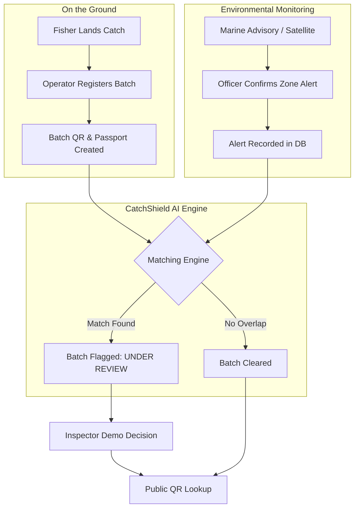

# CatchShield AI 🐟

> **Team LUMIX | ChainCraft Track**
> 
> *A verifiable digital catch passport connecting on-the-ground seafood batches with real-time marine environmental alerts.*

[](https://github.com/Mohanapriya-sparks/CatchShield-AI/actions/workflows/ci.yml)
[](#demonstration)

## 🚨 The Problem

Supply chain traceability often stops at proving *where* a fish came from. But if an environmental disaster (like a chemical spill or red tide) happens in that same zone, standard traceability systems don't automatically flag the affected seafood. **Catch records and environmental alerts exist in silos.**

## 🛡️ The CatchShield Solution

CatchShield AI bridges this gap. It provides a privacy-first verifiable timeline that links environmental alerts to specific catch batches, ensuring that flagged seafood undergoes rigorous inspection before reaching consumers.

### 🔄 How It Works



## ✅ Working in this Prototype

The following core flow is fully functional and demonstrated in this repository:

1. **Batch Registration (Operator):** Create a digital catch passport at the landing centre with a unique QR code and Batch ID.
2. **Zone Environmental Alerts (Officer):** View live/sample marine conditions per zone and officially **confirm** environmental alerts for specific time windows.
3. **Automated Matching:** The system automatically cross-references new batches with active confirmed alerts in their catch zone and timeframe.
4. **Inspection Review:** Flagged batches enter an inspection queue for demo decisions.
5. **Public Lookup (Consumer):** A privacy-safe public QR portal displaying the batch's custody timeline, alert overlaps (if any), and current status without exposing private fisher data or precise coordinates.

## 🚧 Demonstration / Planned Features

This is a functional prototype built for the **ChainCraft** track. The following features are mocked or planned for future development:
- **Trained Pollution AI / Heuristics:** The current alert screening uses heuristics; a full ML pipeline is planned.
- **ARGO Buoy & Live SMS Integration:** Simulated in the prototype.
- **Blockchain Deployment:** Smart contract prototypes are included (`chain/` directory), but live deployment and transaction syncing are simulated in this build.
- **Offline Mesh Syncing:** The UI displays offline warnings, but true peer-to-peer sync requires a mobile wrapper.

## 📸 Screenshots

| Public QR Lookup | Zone Conditions & Alerts |
| :---: | :---: |
| *(See docs/demo.webp for the animated walkthrough!)* | *(See docs/demo.webp for the animated walkthrough!)* |

## 🚀 Quick Start (Local Development)

### Prerequisites
- Python 3.11+
- Node.js 18+
- npm or yarn

### 1. Backend Setup

```bash
cd backend
python -m venv venv
# Windows: .\venv\Scripts\Activate.ps1
# Mac/Linux: source venv/bin/activate

pip install -r requirements.txt
cp .env.example .env

# Run the FastAPI server (starts on port 8000)
# This will automatically seed sample data!
python -m uvicorn app.main:app --reload
```

### 2. Frontend Setup

```bash
cd frontend
npm install

# Start Vite dev server (starts on port 5173)
npm run dev
```

Open `http://localhost:5173` in your browser.

## 🎥 Demonstration

To see CatchShield AI in action:
1. Navigate to `http://localhost:5173` and click **Login as Admin**.
2. Go to **Operator** and register a new batch in **Zone 03** (which has a seeded demo alert).
3. Check the generated Batch ID.
4. Go to **Matching**, run the engine, and see the batch flagged.
5. Go to **Env Officer** and confirm a new alert for a different zone to see dynamic updates.
6. Check the **Public Lookup** for your Batch ID.

**[Watch the full 90-second animated walkthrough here (WebP)](docs/demo.webp)**

## 🔒 Security and Limitations

* **Self-Reported Origins:** Fisher-reported catch zones and times are not independently verified in this version.
* **Hash Verification:** Hashes detect subsequent tampering of recorded data, but they do not guarantee the initial intake was truthful.
* **Food Safety Disclaimer:** **No alert overlap does not prove seafood safety.** This system provides supplementary traceability, not a substitute for physical health inspections.
* **Demo Decisions:** Inspector and Officer actions in this app are demonstration decisions and do not represent official government clearance.

---
*Created for CodeGyaan'26 ChainCraft Track.*
