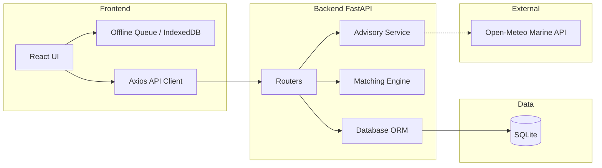

# Architecture

CatchShield AI uses a modern, lightweight tech stack focused on local privacy and reliable verification.

## 🏗️ Core Stack

- **Frontend:** React + Vite, TypeScript, minimal CSS (no heavy UI libraries to keep the bundle small and offline-ready).
- **Backend:** Python + FastAPI.
- **Database:** SQLite with SQLAlchemy (Async).
- **Blockchain (Demo):** Solidity contracts prepared for EVM-compatible chains (Hardhat environment).

## 🧩 System Components

### 1. Frontend Client
Provides role-based access for Operators, Environmental Officers, Inspectors, and Public Consumers. Uses local state and an offline queue mechanism to handle intermittent network connectivity at landing sites.

### 2. FastAPI Backend
Handles RESTful endpoints. The core logic resides in the `matching.py` engine, which compares the time and zone coordinates of new catch batches against active, officer-confirmed environmental alerts.

### 3. Open-Meteo Integration
We utilize the free Open-Meteo Marine API to pull real-time or forecasted wave height and wind speed for designated catch zones.

### 4. Blockchain & Fingerprinting (Simulated)
Data integrity is maintained using SHA-256 fingerprinting. The prototype simulates the final anchoring of these hashes onto a public ledger.
