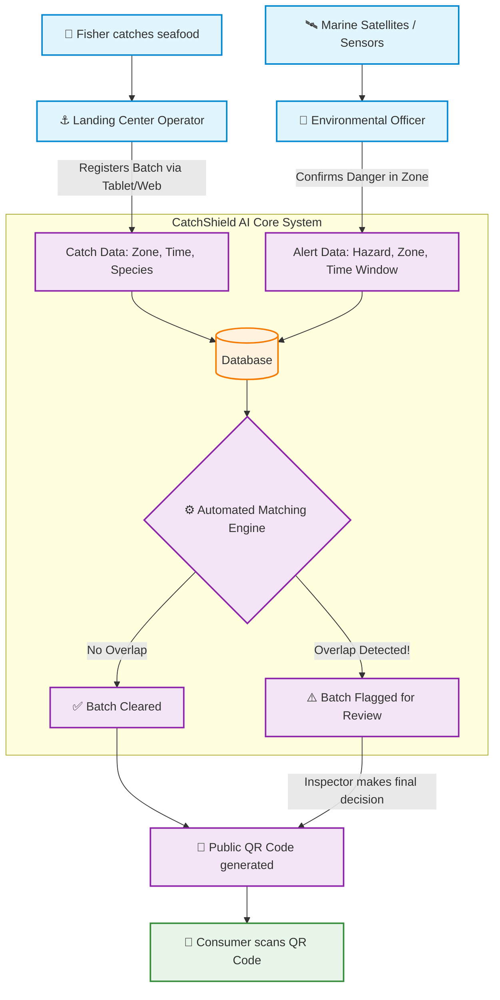

# CatchShield AI — How It Works (High-Level Architecture)

CatchShield AI is designed to be simple, resilient, and privacy-focused. Below is a high-level look at how the different pieces of the system fit together to ensure seafood safety.

## 🌊 The Big Picture

---

## 🛠️ The 3 Main Pillars of CatchShield

To make this system work across remote coastal areas and public supermarkets, we split it into three logical pillars:

### 1. Data Ingestion (The Frontend)
**Technologies used: React, TypeScript, Vite**
*   **What it does:** This is the web application used by the people on the ground (Operators at the docks, Environmental Officers in offices). 
*   **Why it's built this way:** Landing centers often have terrible internet. The frontend is built to be extremely lightweight. It uses an "Offline Queue" system, meaning if an operator loses Wi-Fi while registering a batch of tuna, the app saves it locally and automatically uploads it when the connection returns.

### 2. The Brain (The Backend & Matching Engine)
**Technologies used: Python, FastAPI, SQLite**
*   **What it does:** This is the server that processes all the data. Its most important job is the **Automated Matching Engine**. 
*   **Why it's built this way:** Instead of humans trying to cross-reference thousands of catch records against PDF hazard warnings, the Python backend runs a fast algorithm. Every time a new batch is registered or a new alert is issued, it calculates if they overlap in **both location (Zone) and time**. If they do, it instantly flags the batch. 

### 3. Verification & Privacy (The Ledger & Lookup)
**Technologies used: SHA-256 Fingerprinting, (Simulated) Solidity Smart Contracts**
*   **What it does:** Ensuring that data isn't tampered with after the fact, while protecting the business secrets of the fishers.
*   **Why it's built this way:** If we just dumped all data publicly, fishers would refuse to use the system because competitors would steal their best fishing spots. Instead, CatchShield groups locations into broad "Zones". Furthermore, when a batch is created, a unique cryptographic "fingerprint" is generated. The consumer scanning the QR code sees a privacy-safe timeline of safety checks, but the fisher's exact coordinates and ID remain strictly confidential.
